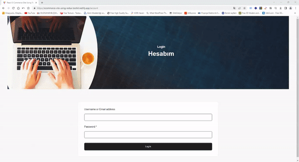

<h1>E-Commerce Uygulaması</h1>

Bu proje, bir e-ticaret uygulamasının temel özelliklerini içeren React-Redux-Toolkit bir web uygulamasını sağlar. Aşağıda projenin özelliklerini ve kullanım talimatlarını bulabilirsiniz.

<h2>Özellikler</h2>
Redux Toolkit kullanılarak durum yönetimi sağlanmıştır. 
Kullanıcılar, giriş ve çıkış işlemlerini gerçekleştirebilir. 
Sanal bir veritabanından ürünler alınarak liste halinde görüntülenir. 
Bazı ürünler, bir kaydırıcı (slider) bileşeni kullanılarak ekrana bastırılır. 
Kullanıcılar, ekrandaki ürünleri sepete ekleyebilir. 
Sepet sayfasında, ürün adetlerini artırıp azaltabilirler. 
Ürün adetine göre fiyatlar otomatik olarak güncellenir. 
Toplam fiyat, seçilen ürün sayısına göre dinamik olarak değişir. 
Kullanıcılar, sayfa ilk yüklendiğinde kullanıcı adı ve şifre ile giriş yapabilir. 
Giriş yapıldığında, ürünler otomatik olarak ekrana gelir. 
"Hesabım" bölümünden çıkış yapılabilir ve kullanıcı giriş ekranına yönlendirilir. 

<h2>Kurulum</h2>
Bu projeyi klonlayın veya ZIP olarak indirin. 
Proje dizinine gidin ve terminali açın. 
Gerekli bağımlılıkları yüklemek için npm install komutunu çalıştırın. 
Projeyi başlatmak için npm start komutunu çalıştırın. 
Web tarayıcınızda http://localhost:3000 adresini açın. 

<h2>Kullanım</h2>
Ana sayfada ürünleri görüntüleyin. 
Ürünleri sepete eklemek için "+" veya "-" düğmelerini kullanın. 
Sepet simgesine tıklayarak sepet sayfasına gidin. 
Sepet sayfasında ürün adetlerini artırıp azaltın. 
Toplam fiyatı gözlemleyin. 
"Hesabım" bölümünden giriş yapın veya çıkış yapın. 

<h2>Redux Toolkit Kullanımı</h2>
Bu projede Redux Toolkit, durum yönetimi için kullanılmıştır. Aşağıda Redux Toolkit ile yapılan işlemleri açıklayan adımları bulabilirsiniz: 

createSlice fonksiyonuyla bir dilim (slice) oluşturulur. Bu dilim, cartSlice.js dosyasında yer almaktadır ve cart adıyla kaydedilir. İlgili dilim, sepetle ilgili durumları ve işlevleri içerir. 
Dilimin başlangıç durumu, initialState olarak tanımlanır. Bu durum, boş bir itemsList (ürün listesi) ve totalQuantity (toplam ürün adedi) içerir. 
addToCart adında bir reducer fonksiyonu tanımlanır. Bu fonksiyon, sepete ürün eklemek için kullanılır. Yeni bir ürün eklenirken mevcut ürünlerle karşılaştırılır ve gerekli güncellemeler yapılır. 
configureStore fonksiyonuyla bir Redux mağazası oluşturulur. Bu mağaza, cart dilimini içeren bir reducer'a sahiptir. 
useDispatch kancası ile bir dispatch fonksiyonu elde edilir. Bu fonksiyon, reducer'lara eylemleri göndermek için kullanılır. 
addToCart fonksiyonu, bir ürünü sepete eklemek için dispatch fonksiyonuyla tetiklenir. Bu fonksiyon, cartSlice dilimindeki addToCart reducer'ını çalıştırır ve sepet durumunu günceller. 

<h2>Teknolojiler</h2>
React.js 
Redux Toolkit 
React Router 
CSS (Stilizasyon için) 
Sanal Veritabanı 

<h2><a href="https://ecommerce-site-using-redux-toolkit.netlify.app">Canlı Önizleme</a></h2>

